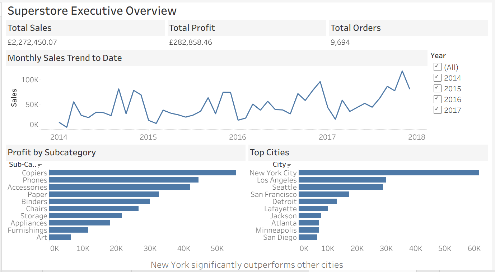

# Superstore Sales Analysis

##  Project Overview
This project analyses retail sales data from a Superstore dataset to uncover trends in revenue, profit and product performance.

The goal was to simulate a real-world business scenario by:
- Cleaning raw data in Excel
- Performing analysis using SQL
- Building an executive dashboard in Tableau

---

##  Tools Used
- Excel (Data Cleaning & Transformation)
- MySQL (Data Analysis & Aggregations)
- Tableau Public (Dashboard & Visualisation)

---

##  Data Cleaning (Excel)
Key cleaning steps:
- Converted date columns to proper date format
- Extracted Year, Month, and Quarter
- Removed duplicates
- Standardised currency and percentage formats
- Checked for null values

Cleaned dataset saved as:
`cleaned_data/superstore_clean.csv`

---

##  SQL Analysis
Key business queries included:
- Total Sales & Total Profit
- Sales by Year
- Top Cities by Profit
- Top Subcategories by Profit

SQL file available here:
`sql_queries/superstore_analysis.sql`

---

##  Tableau Dashboard
The dashboard provides:
- KPI overview (Total Sales, Profit, Orders)
- Monthly sales trend
- Profit by subcategory
- Top performing cities

Dashboard file:
`tableau_dashboard/Superstore Dashboard.twbx`

Preview:

---

##  Key Insights
- Sales increased steadily year-on-year.
- A small number of cities generated a disproportionate share of profit.
- Certain subcategories significantly outperformed others.

---

##  What This Project Demonstrates
- End-to-end data workflow (Excel → SQL → Tableau)
- Data cleaning and transformation skills
- SQL aggregation and grouping
- Dashboard design and storytelling
